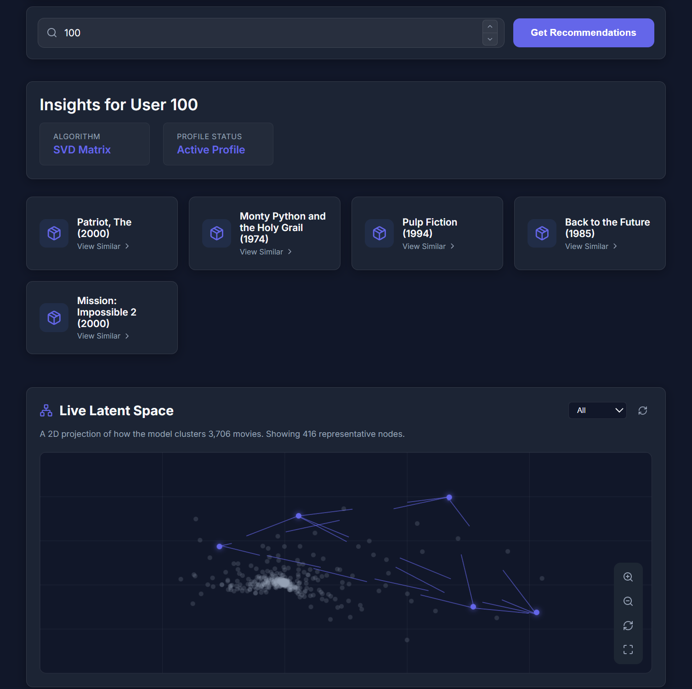
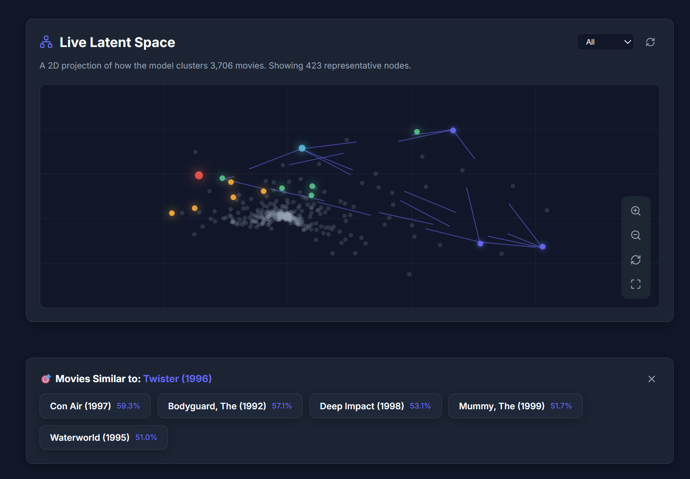
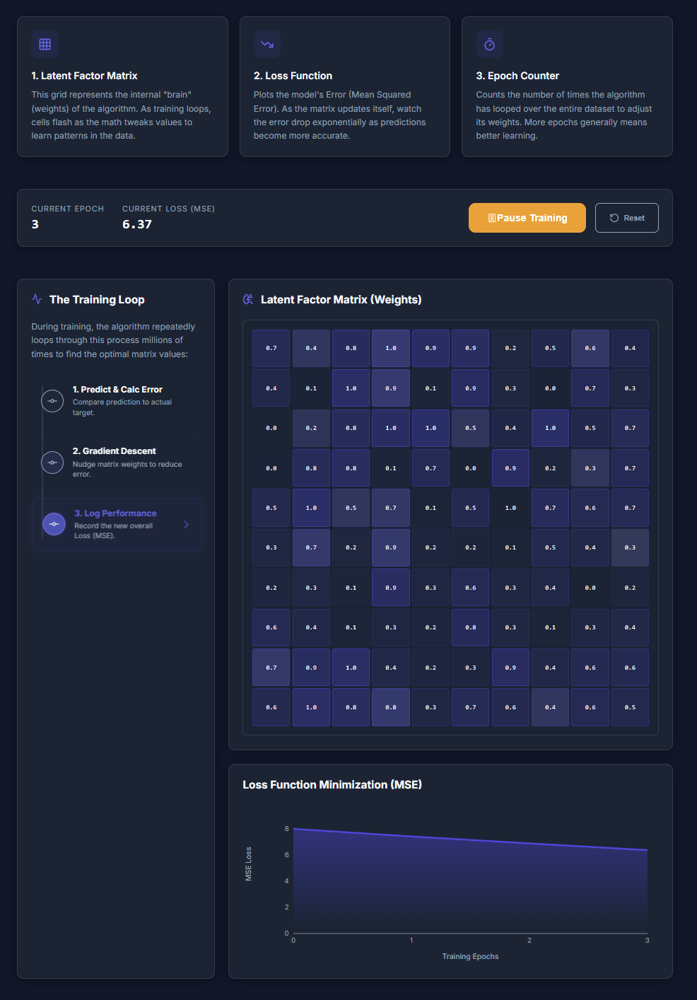
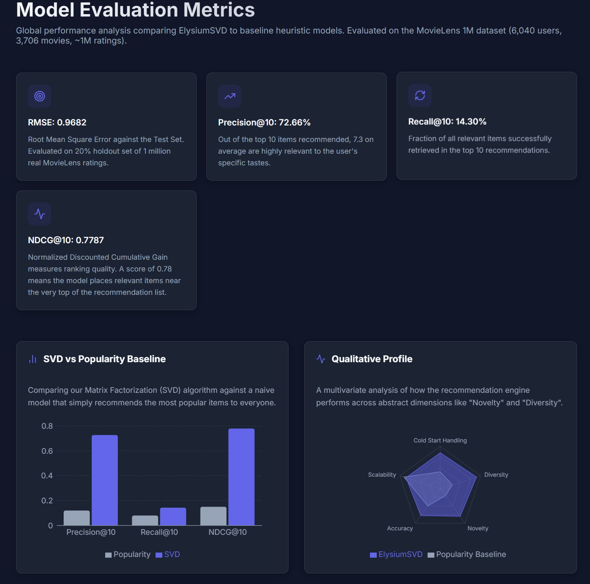
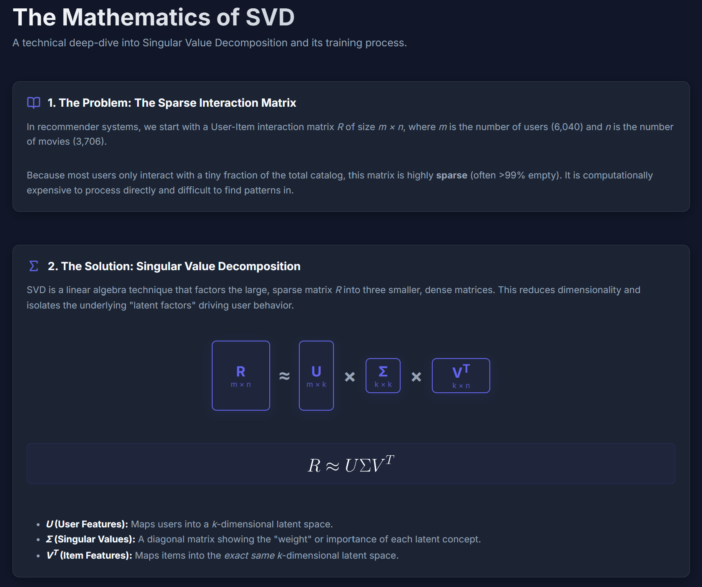

<div align="center">
  <a href="https://elysiumsvd.vercel.app">
    
  </a>
</div>

# ElysiumSVD 🎬
### A Production-Grade Movie Recommendation Engine with Latent Space Visualization

[](https://elysiumsvd.vercel.app)
[](https://render.com)
[](https://python.org)
[](https://reactjs.org)
[](https://hub.docker.com/u/nishkarshs1)

## 🧠 What is ElysiumSVD?

ElysiumSVD is a full-stack, end-to-end Machine Learning web application that delivers **sub-millisecond movie recommendations** in real time. It is built on a custom-trained Truncated SVD model trained on the **MovieLens 1M dataset** (1,000,209 ratings across 3,706 movies and 6,040 users), served via a FastAPI backend with precomputed matrices loaded directly into RAM - completely bypassing any database for inference.

What makes this project different: it doesn't just show results. It teaches the user _how_ the algorithm works - through an interactive Matrix Training Simulation, a Visual SVD Decomposition Block, and a live 2D Latent Space constellation of all 3,706 movies.

## ✨ Key Highlights

- ⚡ **Sub-millisecond inference** - U, Σ, Vt matrices serialized to `.pkl` and loaded into FastAPI RAM on boot; recommendations served via pure `numpy.dot` with zero DB latency
- 🎓 **Educational pages** - live animated training simulation (SGD loss curve converging to MSE 0.937), visual SVD decomposition block in CSS, and system architecture flowchart
- 🗺️ **Live Latent Space Map** - interactive 2D constellation of 3,706 movie vectors; click any node to fetch recommendations
- 🐳 **Dockerized backend** - containerized with Docker to isolate scipy/numpy/pandas dependencies; deployed on Render
- ❄️ **Cold start handling** - unknown users fall back to globally popular movies automatically
- 🌙 **Light/Dark mode** - Glassmorphism UI with GSAP animations throughout

## 📸 Screenshots

**Inference Hub** - Real-time recommendations with real movie names and similarity scores


**Latent Space Map** - 2D constellation of 3,706 movie vectors; click any node for recommendations


**Matrix Training Simulation** - Live SGD loss curve dropping from MSE 8.0 → 0.937


**Model Evaluation Metrics** - RMSE 0.9682, Precision@10 72.66%, NDCG@10 0.7787 vs Popularity Baseline


**SVD Mathematics** - Visual matrix decomposition block R ≈ U·Σ·Vt with real dimensions


## 📊 Model Performance

Trained on **MovieLens 1M** - 1,000,209 real ratings, 80/20 train/test split.

| Metric           | Value      | Description                                    |
| ---------------- | ---------- | ---------------------------------------------- |
| **RMSE**         | **0.9682** | Root Mean Square Error on 20% holdout test set |
| **Precision@10** | **0.7266** | 7.3 out of top 10 recommendations are relevant |
| **Recall@10**    | **0.1430** | Fraction of all relevant items retrieved       |
| **NDCG@10**      | **0.7787** | Normalized ranking quality score               |

## 🏗️ System Architecture

```
User Request
     ↓
React Frontend (Vercel - global edge CDN)
     ↓  axios
FastAPI Backend (Render - Dockerized)
     ├── /recommend/{user_id}    →  Mean-centered SVD matrix → top-N unseen movies
     ├── /similar/{movie_id}   →  Cosine similarity on item latent vectors (Vt)
     ├── /api/v1/latent-space    →  2D coordinates for all 3,706 movies
     ├── /movies                 →  movie_id → movie title mapping
     └── /health                 →  Status check
     ↓
Precomputed Matrices (loaded into RAM at boot)
[ U (6040×50) ]  [ Σ (50×50) ]  [ Vt (50×3706) ]  [ user_ratings_mean (6040×1) ]
```

## 📐 How SVD Works Here

The user-item rating matrix **R** (6,040 users × 3,706 movies) is decomposed using `scipy.sparse.linalg.svds` with **k=50 latent factors** and **mean-centering** for accurate predictions:

```
R_demeaned ≈ U · Σ · Vt
R_predicted = U · Σ · Vt + user_ratings_mean
```

| Matrix              | Shape     | Meaning                                   |
| ------------------- | --------- | ----------------------------------------- |
| `U`                 | 6040 × 50 | User latent factor matrix                 |
| `Σ`                 | 50 × 50   | Diagonal matrix of singular values        |
| `Vt`                | 50 × 3706 | Item latent factor matrix                 |
| `user_ratings_mean` | 6040 × 1  | Per-user mean rating (for mean centering) |

**Recommendations** → predicted ratings row for user, exclude already-rated, return top-N  
**Similar movies** → Cosine similarity between columns of `Vt` (item latent vectors)  
**Latent Space Map** → first 2 dimensions of `Vt` projected to 2D

## 🔌 API Reference

### `GET /recommend/{user_id}?n=5`

```json
// GET /recommend/42?n=5
// "What should User #42 watch next?"
{
  "user_id": 42,
  "recommendations": [0, 2748, 2162, 2511, 1449],
  "cold_start": false
}
// → Toy Story (1995), Fight Club (1999), A Bug's Life (1998),
//   Ghostbusters (1984), Men in Black (1997)
```

- `n`: 1-20, default 5
- Already-rated movies excluded from results
- `cold_start: true` → returns globally popular movies for unknown users

### `GET /similar/{movie_id}?n=5`

```json
// GET /similar/287?n=5
// "Find movies similar to Pulp Fiction (1994)"
{
  "movie_id": 287,
  "similar": [
    { "movie_id": 1017, "similarity": 0.7205 },
    { "movie_id": 1123, "similarity": 0.6149 },
    { "movie_id": 593, "similarity": 0.5134 },
    { "movie_id": 541, "similarity": 0.3843 },
    { "movie_id": 1536, "similarity": 0.371 }
  ]
}
// → Reservoir Dogs (1992), GoodFellas (1990), Fargo (1996),
//   True Romance (1993), Boogie Nights (1997)
```

- `n`: number of similar movies to return (default 5)
- Self-match excluded (Pulp Fiction won't appear in its own results)

### `GET /movies`

```json
// GET /movies
// "Get the mapping of IDs to movie titles"
{
  "0": "Toy Story (1995)",
  "1": "Jumanji (1995)",
  "2": "Grumpier Old Men (1995)"
}
```

- Returns a complete dictionary mapping every `movie_id` to its actual title string.
- Used by the frontend to instantly resolve IDs to human-readable names.

### `GET /api/v1/latent-space`

```json
// GET /api/v1/latent-space
// "Get 2D projection coordinates for the constellation map"
[
  {
    "movie_id": 0,
    "coordinates": { "x": 0.145, "y": -0.832 }
  }
]
```

- Returns the first two principal components (2D coordinates) of the latent vector for all 3,706 movies.
- Used by the frontend to plot the interactive Latent Space Map.

### `GET /health`

```json
{ "status": "ok" }
```

- Simple ping endpoint to check if the FastAPI backend is alive and the model matrices are successfully loaded into RAM.

## 🌐 Pages & Features

| Page                           | What it does                                                                                                             |
| ------------------------------ | ------------------------------------------------------------------------------------------------------------------------ |
| **Inference Hub**              | Enter User ID (0–6039) → get top-5 movie recommendations with titles and similarity scores; interactive Latent Space Map |
| **Matrix Training Simulation** | Live animated SGD training loop - flashing weight grid, loss curve dropping MSE 8.0 → 0.937, epoch counter               |
| **SVD Mathematics**            | Visual CSS matrix decomposition block (R ≈ U·Σ·Vt), cosine similarity formula, gradient descent update rules             |
| **System Architecture**        | End-to-end data pipeline diagram: ingestion → training → serialization → FastAPI serving                                 |
| **API Docs**                   | Interactive endpoint explorer with live `/health` ping                                                                   |
| **Metrics**                    | RMSE, Precision@10, Recall@10, NDCG@10 - SVD vs Popularity Baseline bar chart + qualitative radar                        |

## 🛠️ Tech Stack

### Backend

| Library           | Role                                        |
| ----------------- | ------------------------------------------- |
| FastAPI + Uvicorn | Async REST API, ASGI server                 |
| SciPy `svds`      | Truncated SVD matrix factorization          |
| NumPy             | Matrix ops, dot products, cosine similarity |
| Scikit-learn      | RMSE, train/test split                      |
| Pandas            | Data loading, MovieLens parsing             |
| Joblib            | Model serialization (.pkl)                  |
| Pydantic          | Request/Response schemas                    |
| Docker            | Containerization for deployment             |

### Frontend

| Library         | Role                                 |
| --------------- | ------------------------------------ |
| React 18 + Vite | UI framework + build tool            |
| Axios           | HTTP requests to backend             |
| Recharts        | Loss curve, metrics bar/radar charts |
| GSAP            | Page transitions + animations        |
| React Router    | Client-side routing                  |
| Lucide React    | Icons                                |

## 🐳 Running with Docker (Recommended)

Both the frontend and backend are fully Dockerized for a flawless out-of-the-box experience. You can pull the pre-built images directly from my [Docker Hub Profile](https://hub.docker.com/u/nishkarshs1) (zero setup required).

### Backend (Port 10000)

```bash
# Just run it instantly:
docker run -p 10000:10000 nishkarshs1/elysiumsvd:backend

# Or if you want to build it yourself from source:
# cd mlRecommender
# docker build -t elysium-backend .
# docker run -p 10000:10000 elysium-backend
```

### Frontend (Port 5173)

```bash
# Just run it instantly:
docker run -p 5173:5173 nishkarshs1/elysiumsvd:frontend

# Or if you want to build it yourself from source:
# cd mlDash
# docker build -t elysium-frontend .
# docker run -p 5173:5173 elysium-frontend
```

## 🚀 Running Locally (Manual)

### Backend

```bash
cd mlRecommender
pip install -r requirements.txt
uvicorn app.main:app --reload --port 8000
```

### Frontend

```bash
cd mlDash
npm install
npm run dev
```

_(If running manually, the frontend will default to targeting `localhost:8000` for the API)._

## 📁 Project Structure

```
ElysiumSVD/
├── mlRecommender/              # FastAPI backend
│   ├── app/
│   │   ├── main.py             # API endpoints
│   │   └── recommender.py      # SVD inference engine
│   ├── model/                  # U.pkl, sigma.pkl, Vt.pkl,
│   │   │                       # ratings_df.pkl, user_ratings_mean.pkl
│   ├── ml-1m/                  # MovieLens 1M dataset
│   ├── SVD_Training.ipynb      # Model training notebook
│   ├── Dockerfile
│   └── requirements.txt
└── mlDash/                     # React frontend
    ├── src/
    │   ├── pages/              # Inference Hub, Simulation, Metrics etc.
    │   └── components/         # LatentSpaceMap, charts, UI
    └── package.json
```

## 👤 Author

**Nishkarsh Sharma**  
B.Tech CSE, IIITDM Jabalpur (2nd Year)  
[GitHub](https://github.com/nishkarshs1) • [Live Demo](https://elysiumsvd.vercel.app)
